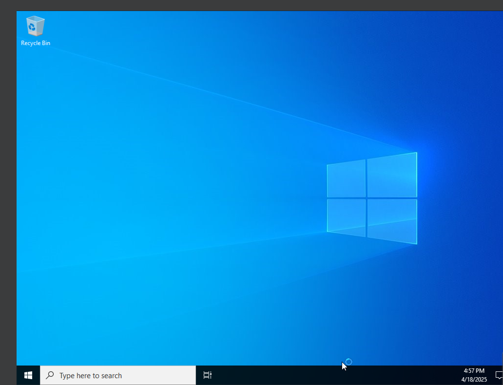
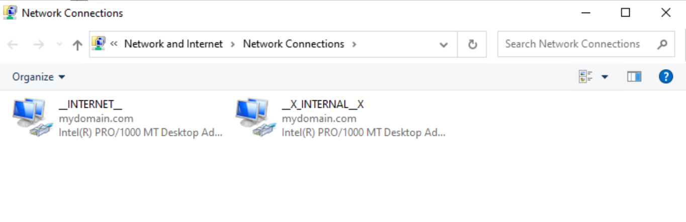
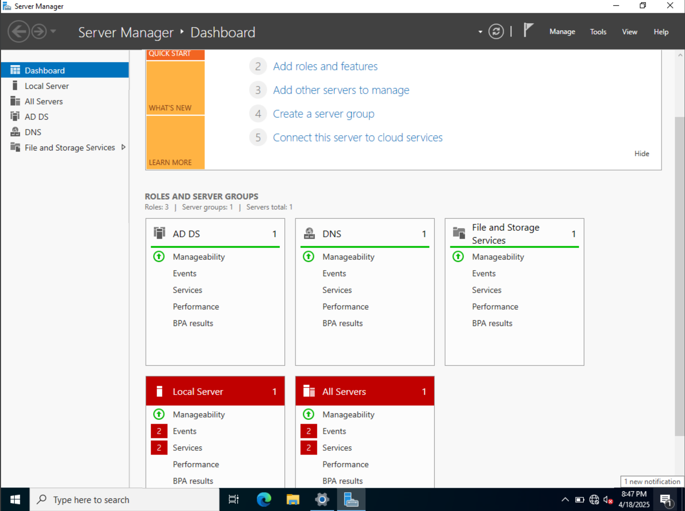
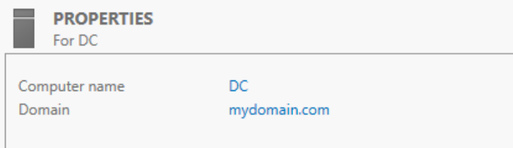

# Active Directory Home Lab

## ✍️ Introduction

This project is to build an Active Directory Home Lab 
which will then be utilized to create a corporate network simulation 
with security practices.

## 🛠️ Tools Used

---

- VMWare Workstation Pro17
- PowerShell
- Windows 11
- Windows Server 2022

---

I configured Windows Server 2022 as my Domain Controller (DC) and this will be utilized as the Default Gateway for the two NICs.

I Included two Network Adapters, one is to attach to NAT 
(Internet) and other one is to the Internal Network (Isolated).  I then 
configured the Internal Network to set up the IP address, subnet mask, 
and DNS.

Next, I Installed AD DS (Active Directory Domain Services) and created a domain.

I went to the Local Server to see my Domain being listed on the Properties section.

I went ahead and got into the Windows Administrative Tools
 then into Active Directory Users and Computers to create a domain admin
 account.

Next, I installed and configured RAS (Remote Access 
Server) with NAT (Network Address Translation). This will be utilized 
for the Windows 11 client to be in a private-virtual network, but still 
be able to access the Internet through the DC.

Next, I installed DHCP Server for the Windows 11 client to
 get an IP address which will give it access to the Internet meanwhile, 
it's in a private-internal network.

---

## 📁 Files

- `1_CREATE_USERS.ps1` - I downloaded a custom powershell
script to create a list of users. I then edited the powershell script to implement password security.
- `names.txt` - Over (+1000 users) in the text file to use for the AD Lab.

---

I utilize the command Set-ExecutionPolicy Unrestricted to 
be able to run PowerShell scripts that are downloaded from the Internet.
 I then switched directories and executed the PowerShell script.

As we see, the custom PowerShell script created (+1000) users for the AD Lab.

For Windows 11 to be in a private-internal network, it 
needs to be bypassed through the network settings and act as an Internal
 NIC. The Client is going to obtain the IP address from the DHCP Server 
I've configured.

As the Client doesn't have a default gateway I included a Router through the DHCP Server Options and a loopback address.

I then configured my Windows 11 Client for it to be a 
member of mydomain.com. We can verify this through the Address Leases on
 my Domain Controller.

Finally, I logged in to my Client through the domain, MYDOMAIN and verified I am in.

---

## Conclusion

As I completed the setup of my Active Directory Home Lab 
using the various tools listed and obtaining over a thousand users, I am
 ready to create a corporate network simulation to implement security 
strategies.

## Source

Josh Madakor, Youtuber in the cybersecurity/information technology field.
