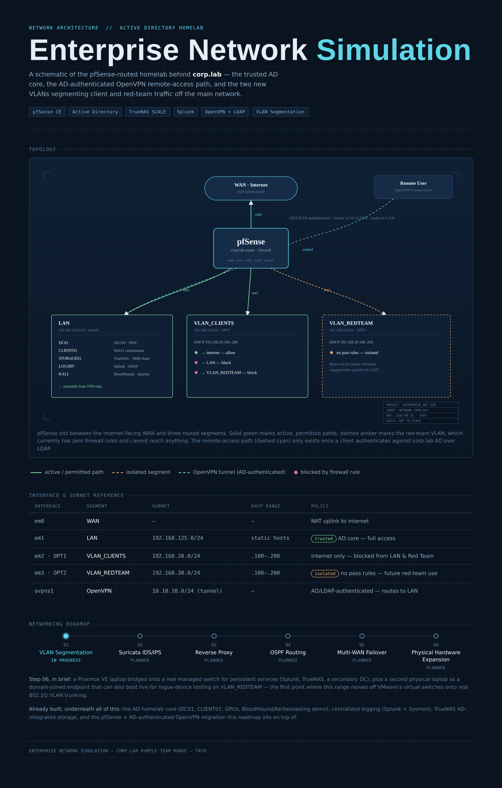

# Enterprise Network Simulation

A segmented, AD-authenticated enterprise range built as a hands-on purple-team practice environment. Active Directory at the core, pfSense doing real routing and VLAN segmentation around it, TrueNAS and Splunk providing storage and detection, and Kali/BloodHound driving attack simulation against it — all virtualized, all documented as it was built.

> Started as a single-domain Active Directory homelab. Expanded into a routed, segmented, monitored range once pfSense, TrueNAS, Splunk, and remote access got layered on.

## Overview

| | |
|---|---|
| **Domain** | `corp.lab` |
| **Hypervisor** | VMware Workstation (Proxmox VE planned — see [Roadmap](#roadmap)) |
| **Router / Firewall** | pfSense CE |
| **Directory Services** | Active Directory Domain Services, DNS, Group Policy |
| **Storage** | TrueNAS SCALE, domain-joined, AD-group-scoped NFSv4 ACLs |
| **Detection** | Splunk Enterprise + Universal Forwarder, Sysmon (SwiftOnSecurity) |
| **Offense** | Kali Linux, BloodHound CE, Impacket, Hashcat |
| **Remote Access** | OpenVPN, LDAP-authenticated against `corp.lab` |

## Architecture

pfSense sits between the internet-facing WAN and three routed segments: a trusted LAN carrying the AD homelab hosts, a client VLAN with internet-only access, and a fully isolated VLAN reserved for red-team work. A remote OpenVPN client authenticates against `corp.lab` AD before it's routed into the LAN.

| Interface | Segment | Subnet | DHCP Range | Policy |
|---|---|---|---|---|
| `em0` | WAN | — | — | NAT uplink to internet |
| `em1` | LAN | `192.168.125.0/24` | static hosts | Trusted — AD core, full access |
| `em2` · OPT1 | VLAN_CLIENTS | `192.168.20.0/24` | `.100`–`.200` | Internet only — blocked from LAN & Red Team |
| `em3` · OPT2 | VLAN_REDTEAM | `192.168.30.0/24` | `.100`–`.200` | Isolated — zero pass rules, reserved for future red-team use |
| `ovpns1` | OpenVPN | `10.10.10.0/24` (tunnel) | — | AD/LDAP-authenticated, routes to LAN |

| Host | Role |
|---|---|
| `DC01` | Domain controller — AD DS, DNS |
| `CLIENT01` | Windows 11 workstation, domain-joined |
| `STORAGE01` | TrueNAS SCALE — AD-joined SMB storage |
| `LOGSRV` | Splunk Enterprise — SIEM / log aggregation |
| Kali | Attacker workstation — BloodHound, Impacket, Hashcat |

## What's built

**Active Directory core** — `corp.lab` domain with an OU tree across 8 departments, 1,050 provisioned user accounts, help-desk delegation, and GPOs enforcing a logon banner, a UNC-based wallpaper policy (loopback processing, merge mode), and a Control Panel/Settings restriction — all verified against `CLIENT01` after `gpupdate /force`.

**Centralized logging** — Sysmon (SwiftOnSecurity config) on `DC01` and `CLIENT01`, forwarded through Splunk Universal Forwarder into Splunk Enterprise on `LOGSRV`. TrueNAS syslog forwards over UDP `5514`.

**AD-integrated storage** — `STORAGE01` (TrueNAS SCALE) domain-joined via Kerberos credentials, serving an SMB share with an NFSv4 ACL scoped to the `CORP\operations-staff` AD group — verified by a non-admin domain user writing to the share and an admin account *without* group membership being correctly denied, over both LAN and VPN.

**pfSense migration & OpenVPN remote access** — pfSense CE installed in front of the lab as the router/firewall. Remote access via OpenVPN, authenticating against `corp.lab` AD over LDAP (UPN-format bind DN), split-tunneled to route only `192.168.125.0/24`. Verified end-to-end: routed ping, pfSense LAN UI, and an authenticated SMB mount over the tunnel (after chasing down a WAN private-network block and an MTU/fragmentation issue with `tun-mtu 1400; mssfix 1360`).

**VLAN segmentation** *(in progress)* — Two new interfaces off pfSense: `VLAN_CLIENTS` (internet access, blocked from LAN and from Red Team) and `VLAN_REDTEAM` (fully isolated, no pass rules, DHCP-only) — each with its own scope and firewall policy.

**Attack simulation, closed-loop to detection** — From Kali: `bloodhound-ce-python` enumeration over LDAP as a low-privilege user (1,030 users, 61 groups, 34 OUs collected), a clean baseline confirmed (no path to Domain Admins, no Kerberoastable accounts), then a deliberately weak service account (`svc_sql`, SPN-registered) introduced and attacked with `impacket-GetUserSPNs` and cracked offline with Hashcat. The attack showed up in Splunk on the first query — `EventCode=4769`, exact account and source IP — closing the loop from offense to detection on the existing Sysmon + Splunk pipeline with no new instrumentation.

## Roadmap

| # | Step | Status |
|---|---|---|
| 01 | VLAN Segmentation | In progress |
| 02 | Suricata IDS/IPS | Planned |
| 03 | Reverse Proxy | Planned |
| 04 | OSPF Dynamic Routing | Planned |
| 05 | Multi-WAN Failover | Planned |
| 06 | Physical Hardware Expansion | Planned |

Step 06 moves part of the range off virtual switches: a Proxmox VE laptop for persistent services (Splunk, TrueNAS, a secondary DC) and a second physical laptop as a domain-joined endpoint that can also boot live for rogue-device testing — bridged through a real managed switch, which is what finally allows genuine 802.1Q VLAN trunking (VMware Workstation's virtual switches don't support it).

## Documentation

Full build walkthroughs, including every troubleshooting step and the exact fixes for each issue hit along the way, are written up as part of the project docs — TrueNAS AD storage build, and the pfSense OpenVPN + AD remote access build, with more added as each roadmap step lands.

---

Built and documented by TAYO.
